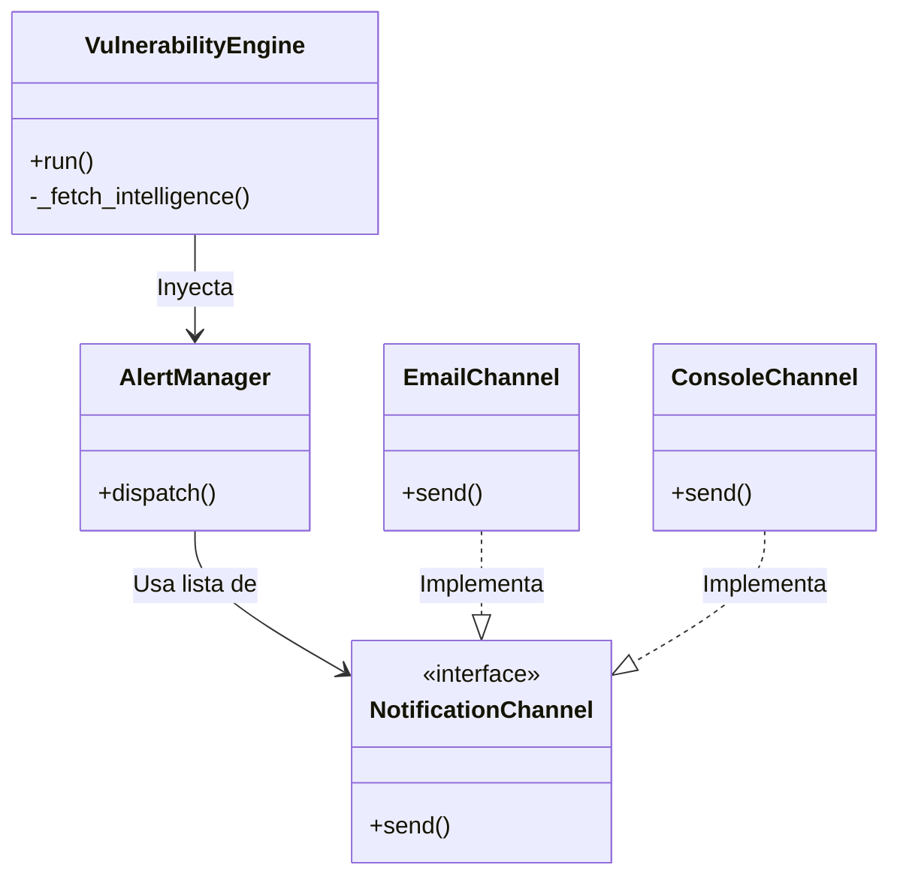

# 🛡️ VulnGuard - Automated Vulnerability Engine


**VulnGuard** es un motor de ingestión y análisis de vulnerabilidades (CVEs) diseñado con una arquitectura modular en Python. Su objetivo es automatizar la detección de amenazas críticas y notificar a los equipos de seguridad en tiempo real.

A diferencia de un script de scraping tradicional, VulnGuard ha sido diseñado siguiendo principios de **Arquitectura de Software (SOLID)** para garantizar escalabilidad, mantenibilidad y robustez en entornos de producción.

## 🚀 Características Clave

* **Arquitectura Modular:** Implementación del patrón *Strategy* para el sistema de notificaciones, permitiendo añadir nuevos canales (Slack, Teams, Telegram) sin modificar el núcleo del motor.
* **Lógica de Negocio Robusta:** Sistema de deduplicación de eventos para evitar "fatiga de alertas" en los analistas.
* **Fail-Safe:** Manejo robusto de señales del sistema (`SIGINT`) y modos de simulación (`--dry-run`).
* **Type Safety:** Uso extensivo de `Type Hinting` y `Dataclasses` para asegurar la robustez del código.
* **CLI Ready:** Interfaz de línea de comandos profesional con `argparse` y flags de configuración.
* **Zero Dependencies:** Funciona con Python 3.8+ estándar, sin librerías externas pesadas.

## 🛠️ Diseño del Software

### Diagrama de Clases (Simplificado)


1.  **VulnerabilityEngine:** Orquestador ETL (Extract, Transform, Load).
2.  **AlertManager:** Gestiona la lógica de despacho de alertas.
3.  **NotificationChannel (Interface):** Contrato abstracto que permite polimorfismo en los canales de envío.


## 📦 Instalación y Uso

**Prerrequisitos**
* Python 3.8 o superior.

1. **Clonar el repositorio**
```bash
git clone https://github.com/TuUsuario/vuln-guard.git
cd vuln-guard
```
2. **Ejecución Básica:**
El modo por defecto buscará vulnerabilidades con score > 8.0.

```bash
python vuln_guard.py
```
3. **Personalización (CLI):**
Puedes ajustar el umbral de riesgo, el email de destino o activar el modo seguro.

**Modo Simulación (Dry Run):** No envía correos reales, solo simula el tráfico.

```bash
python vuln_guard.py --dry-run
```

**Ajustar Sensibilidad:** Detectar vulnerabilidades medias (Score > 4.0).

```bash
python vuln_guard.py --min-score 4.0 --email seguridad@miempresa.com
```

## 👨‍💻 Tecnologías Utilizadas
**Python 3.10+:** `dataclasses`, `typing`, `abc`.

**Logging Avanzado:** `logging.Formatter` personalizado con inyección ANSI.

**CLI Parsing:** Librería `argparse`.

**System Signals:** Manejo de interrupciones con `signal`.

## ⚠️ Aviso legal

Este script está diseñado con fines educativos y de demostración de arquitectura de software. El autor no se hace responsable del uso indebido de esta herramienta.

## 📄 Licencia
Este proyecto está bajo la Licencia MIT - ver el archivo LICENSE para más detalles. Desarrollado con ❤️ por ivanchuu9.
